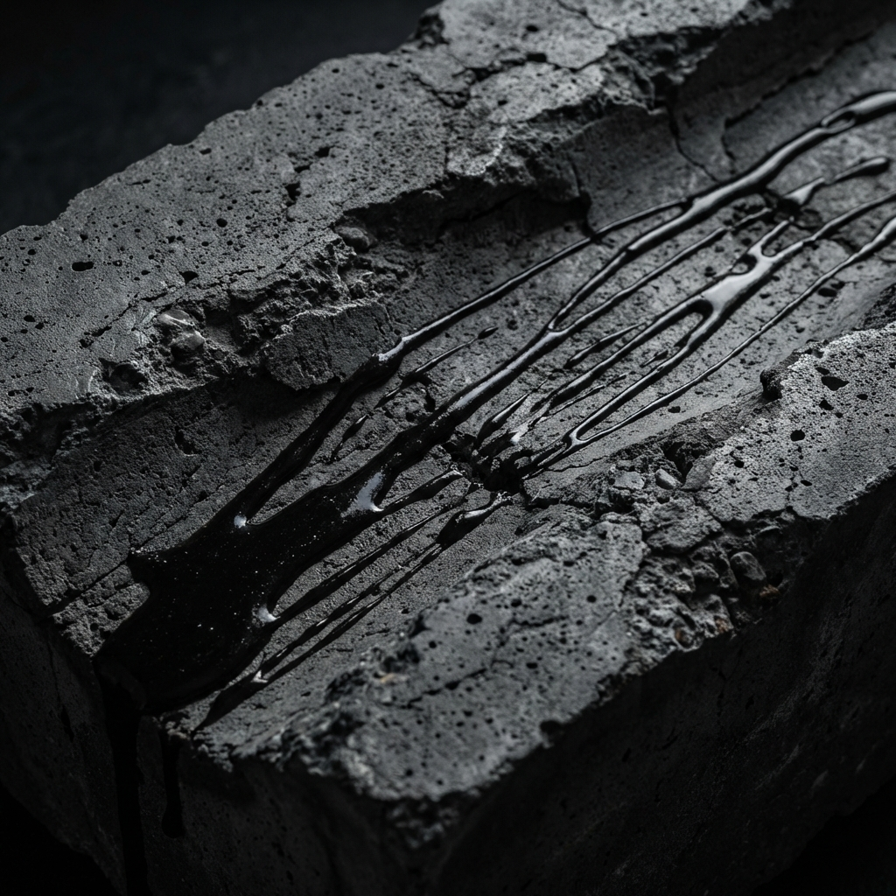

<div align="right">

**語言**: [🇺🇸 English](README.md) | [🇹🇼 繁體中文](README.zh-TW.md)

</div>

<div align="center">

# 🏛️ L'ÉCLAT DE PIERRE | 石之光耀 · 可食建築

[](LICENSE)
[](https://eugenewu1019.github.io/leclat-de-pierre/)
[](https://github.com/eugenewu1019/leclat-de-pierre/actions)
[](https://www.typescriptlang.org/)
[](https://vitejs.dev/)
[](CONTRIBUTING.md)

**風味中的結構力學。混凝土的美學。**

[線上展示](https://eugenewu1019.github.io/leclat-de-pierre/) · [回報問題](https://github.com/eugenewu1019/leclat-de-pierre/issues) · [功能建議](https://github.com/eugenewu1019/leclat-de-pierre/issues) · [討論](https://github.com/eugenewu1019/leclat-de-pierre/discussions)



</div>

---

## 📚 目錄

- [關於專案](#-關於專案)
- [核心特色](#-核心特色)
- [技術栈](#️-技術栈)
- [開始使用](#-開始使用)
- [專案結構](#-專案結構)
- [部署](#-部署)
- [貢獻指南](#-貢獻指南)
- [授權](#-授權)
- [聯絡方式](#-聯絡方式)
- [致謝](#-致謝)

---

## 🎯 關於專案

**L'ÉCLAT DE PIERRE**（石之光耀）是一個融合「建築美學」與「法式甜點」的高端數位藝廊。深受**野獸派 (Brutalism)** 與**解構主義**啟發，本專案透過灰階美學與精確的結構計算，重新定義甜點的感官體驗。

由建築師轉型的甜點師創立，展覽中的每一件作品都被視為一座微型建築：食材即建材，盤中即基地。

### 為什麼有這個專案？

- 🎨 **設計理念**：融合建築原理與烹飪藝術
- 🏗️ **野獸派美學**：護流原始混凝土質感與單色調調色盤
- 🔍 **互動體驗**：藍圖模式將甜點轉化為 CAD 技術線稿
- 🌍 **雙語 UX**：為全球觀眾提供無縫語言切換
- ⚡ **效能**：平滑的自訂義吸附滾動與優化動畫

---

## ✨ 核心特色

### 🏗️ 建築「藍圖」模式
- 互動式掃描效果，將甜點照片轉化為 CAD 技術線稿
- 詳細的結構分析：層次厚度、制作步驟、風味力學
- 真實的工程線稿美學與尺寸標註

### 🖼️ 吸附式滾動展覽
- 客製化平滑吸附滾動，一次翻一頁的觀展體驗
- 大氣模糊與景深過度效果
- 藝廊級呈現與編輯式排版

### 🎨 野獸派美學
- 單色調調色盤，結合混凝土質感與毛玻璃效果
- 高端互動設計，具有磁吸效果
- 雜訊紋理背景，營造真實材質感

### 🌍 雙語支援
- 完整的國際化實現（英文 / 繁體中文）
- 即時語言切換，使用 localStorage 持久化
- SEO 優化的兩種語言 metadata

---

## 🛠️ 技術栈

### 核心
- [React 19](https://react.dev/) - 現代 UI 函式庫
- [Vite](https://vitejs.dev/) - 極速構建工具
- [TypeScript](https://www.typescriptlang.org/) - 類型安全與更好的開發體驗

### 樣式與 UI
- [Tailwind CSS](https://tailwindcss.com/) - Utility-first CSS 框架
- 自訂義 CSS - 進階混合模式與混凝土質感
- [Lucide React](https://lucide.dev/) - 精美圖示集

### 開發工具
- [GitHub Actions](https://github.com/features/actions) - CI/CD 自動化
- TypeScript 嚴格模式 - 增強類型檢查
- 自訂義 Intersection Observer - 高效滾動偵測

---

## 🚀 開始使用

### 前置需求

- **Node.js** 18.0 或更高版本
- **npm** 或 **yarn** 或 **pnpm**

### 安裝

1. **克隆儲存庫**
   ```bash
   git clone https://github.com/eugenewu1019/leclat-de-pierre.git
   cd leclat-de-pierre
   ```

2. **安裝依賴**
   ```bash
   npm install
   # 或
   yarn install
   # 或
   pnpm install
   ```

3. **啟動開發伺服器**
   ```bash
   npm run dev
   # 或
   yarn dev
   # 或
   pnpm dev
   ```

4. **在瀏覽器中開啟**
   
   開啟 [http://localhost:5173](http://localhost:5173)

### 生產環境構建

```bash
# 創建優化的生產構建
npm run build

# 本地預覽生產構建
npm run preview
```

---

## 📂 專案結構

```text
leclat-de-pierre/
├── src/
│   ├── assets/              # 圖片與靜態資源
│   ├── components/          # React 組件
│   │   ├── Modal.tsx        # 藍圖彈窗
│   │   └── Navbar.tsx       # 導航列
│   └── App.tsx              # 主應用程式
├── constants.ts          # 結構數據與描述
├── types.ts               # TypeScript 接口
├── index.html             # HTML 入口
├── vite.config.ts         # Vite 配置
├── tsconfig.json          # TypeScript 配置
├── tailwind.config.js     # Tailwind 配置
├── .github/
│   └── workflows/
│       ├── ci-cd.yml        # CI/CD 流程
│       └── deploy.yml       # 部署工作流
└── README.zh-TW.md        # 本文件
```

---

## 🚀 部署

### GitHub Pages（當前設定）

專案已配置為推送至 `main` 分支時自動部署到 GitHub Pages。

1. **啟用 GitHub Pages**
   - Settings → Pages → Source: GitHub Actions

2. **推送至 main 分支**
   ```bash
   git push origin main
   ```

3. **GitHub Actions 將自動**：
   - 執行類型檢查
   - 構建專案
   - 部署到 GitHub Pages

---

## 🤝 貢獻指南

貢獻讓開源社群更加美好！任何貢獻都將被**高度感謝**。

請閱讀我們的 [貢獻指南](CONTRIBUTING.md) 以了解：

- 行為準則
- 開發流程
- 如何提交 Pull Request
- 編碼規範
- Commit 訊息約定

### 貢獻者快速開始

1. Fork 專案
2. 創建您的功能分支 (`git checkout -b feature/AmazingFeature`)
3. 提交您的更改 (`git commit -m 'feat: add some AmazingFeature'`)
4. 推送到分支 (`git push origin feature/AmazingFeature`)
5. 開啟 Pull Request

---

## 🐛 問題回報與功能建議

發現問題或有功能想法？

- **問題回報**：[創建 issue](https://github.com/eugenewu1019/leclat-de-pierre/issues/new?template=bug_report.md)
- **功能建議**：[創建 issue](https://github.com/eugenewu1019/leclat-de-pierre/issues/new?template=feature_request.md)
- **問題討論**：[開啟討論](https://github.com/eugenewu1019/leclat-de-pierre/discussions)

---

## 📝 授權

本專案採用 MIT 授權。詳見 [`LICENSE`](LICENSE)。

---

## 📬 聯絡方式

**Eugene Wu (Pierre Lin)** - UI/UX 設計師 & 前端開發者

- LinkedIn: [@owenwuwork](https://www.linkedin.com/in/owenwuwork)
- GitHub: [@eugenewu1019](https://github.com/eugenewu1019)
- 作品集：[即將推出]

**專案連結**: [https://github.com/eugenewu1019/leclat-de-pierre](https://github.com/eugenewu1019/leclat-de-pierre)

**線上展示**: [https://eugenewu1019.github.io/leclat-de-pierre/](https://eugenewu1019.github.io/leclat-de-pierre/)

---

## 🙏 致謝

特別感謝：

- [React](https://react.dev/) - UI 函式庫
- [Vite](https://vitejs.dev/) - 構建工具
- [Tailwind CSS](https://tailwindcss.com/) - CSS 框架
- [Lucide Icons](https://lucide.dev/) - 圖示集
- [TypeScript](https://www.typescriptlang.org/) - 類型安全

---

<div align="center">

**[⬆️ 回到頂端](#️-léclat-de-pierre--石之光耀-·-可食建築)**

由 [Eugene Wu](https://github.com/eugenewu1019) 用 🖖️ 打造

© 2026 L'ÉCLAT DE PIERRE. 保留所有權利。

</div>
